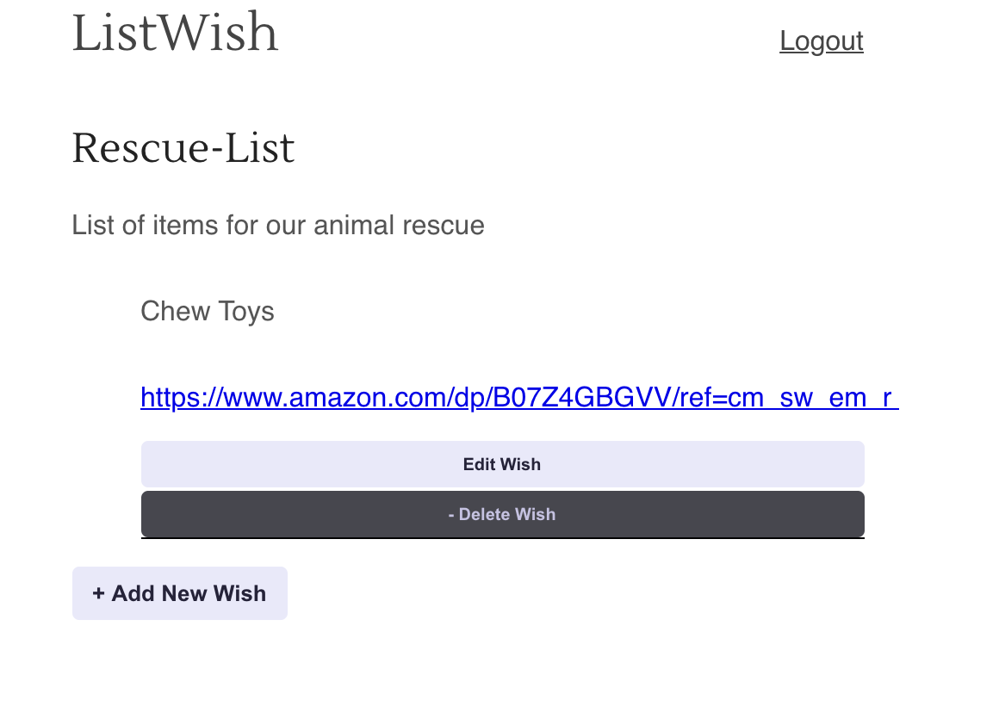

# ListWish App - Frontend

[Deployed to Vercel](https://listwish.vercel.app/)

[Backend repo here](https://github.com/lipcowan/listWish-server)

## ListWish is a wishlist/registry product for 501(c)(3) non-profits. 

#### Version 1 is currently deployed with the ability to add new lists and new items (wishes) to those lists.

#### Demo Account

Some lists and wishes have been added to get you started, to practice using the app feel free to use our demo account - see credentials below.

- User Name: Test_User
- Password: P@ssword1

## Current Features

### Register Account

### Login

### View Lists

#### Add New List

#### Delete List

Once you're logged-in select the delete list button.

### View List and Wishes

#### Edit Wish

Changed the 'z' to an 's'

#### Add Wish

#### Delete Wish
Select the delete wish button. 
- Currently there is an occasional bug due to server delay after a new wish is added and then immediately deleted, this will be corrected in later versions, if you encounter this error try refreshing the page. 

## Coming in later updates ...

- Share your list

- User Profile

- Follow org's lists

##### Contact Me

Have any questions or recommendations?
- phillip.cowan@icloud.com 

